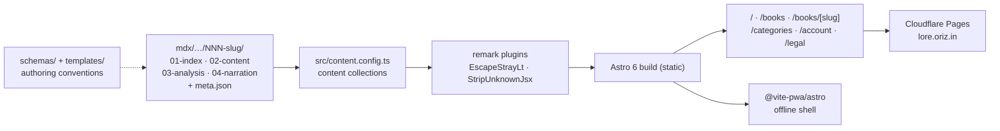

# oriz·lore — Knowledge summaries

> A free, ad-supported nocturne archive of structured summaries across books, courses, documentaries, lectures, podcasts, and papers.

[](./LICENSE)
[](https://github.com/chirag127/oriz-lore/stargazers)
[](https://github.com/chirag127/oriz-lore/commits)
[](https://astro.build)

**Live site:** https://lore.oriz.in · **GHP landing:** https://chirag127.github.io/oriz-lore/ · **Repo:** https://github.com/chirag127/oriz-lore

⭐ If this is useful, please star the repo — it helps others find it.

Every artifact gets a four-part MDX set — **overview**, **content map**, **critical analysis**, **narration script** — plus a `meta.json`. Titles are organised in a category tree (`NN-top-category / NN-discipline / NN-topic / NNN-slug/`) and the whole thing builds to a static Astro site.

## Content pipeline



## Features

- **Four-part artifacts per title** — index / content map / analysis / narration, authored in MDX from shared templates.
- **Browse surfaces** — home, books index (`/books`), per-book pages (`/books/[slug]`), categories index (`/categories`).
- **Shared oriz account** — sign-in via `@clerk/clerk-react` + Firebase, consistent across the family.
- **PWA / offline shell** — installable, with API/account routes forced network-only.
- **Free & ad-supported** — public content reads with no auth.

## Tech stack

Astro 6 (static output) · `@astrojs/mdx` + custom remark plugins · React 19 islands · `@clerk/clerk-react` + `firebase` for account · Tailwind CSS v4 (`@tailwindcss/vite`) · `@vite-pwa/astro` · `@chirag127/oz-ai` (keyless AI) · Biome · Vitest + Playwright · Wrangler (Cloudflare Pages).

## Repo structure

```
mdx/                 # authored artifacts, category-tree layout
schemas/             # meta.json / artifact schemas
templates/           # authoring templates for each of the 4 parts
knowledge/           # app-specific decisions & runbooks
src/
  content.config.ts  # Astro content collections
  pages/             # index, books/, categories/, account, legal
  components/        # Header, Sidebar, ReadingRibbon, PassageLamp, …
  layouts/BaseLayout.astro
  lib/               # firebase.ts, siteConfig.ts, remark plugins
astro.config.mjs · biome.json · playwright.config.ts · vitest.config.ts
```

## Quick start

```bash
pnpm install
pnpm dev            # astro dev
pnpm build          # astro build → dist/
pnpm test           # vitest
pnpm test:e2e       # playwright
```

Deploy (Cloudflare Pages): `astro build && wrangler pages deploy dist --project-name oriz-lore --branch main --commit-dirty=true`.

## Configuration

Uses the family-wide env set (see [`.env.example`](./.env.example)). App-specific keys are limited to the shared account layer.

| Variable | Purpose |
| :--- | :--- |
| `PUBLIC_CLERK_PUBLISHABLE_KEY` | Clerk publishable key for the shared `*.oriz.in` sign-in (client-only). |
| `PUBLIC_FIREBASE_*` | Firebase client config for account features (client-only). |

## Security note

No secrets in repo — `.env` is `sops`+`age`-encrypted (`.env.enc`). All `PUBLIC_*` values are client-only; no server secret is ever exposed. Public content requires no auth; sign-in gates only account features.

## Part of the oriz family

One of ~80 sites and tools in the [oriz](https://blog.oriz.in) family by Chirag Singhal — runs **$0 on the Cloudflare free tier**. Siblings: [oriz-home](https://github.com/chirag127/oriz-home) (the apex hub that links here) · [omnijournal](https://github.com/chirag127/omnijournal) (open-source PKM).

## Contributing

PRs welcome; open an issue first for large changes. See [CONTRIBUTING.md](./CONTRIBUTING.md). Conventional commits are the changelog.

## Status

Stable / in production; per-category landing pages and audio narration playback are WIP.

## License

MIT © Chirag Singhal — chirag@oriz.in · see [LICENSE](./LICENSE).
